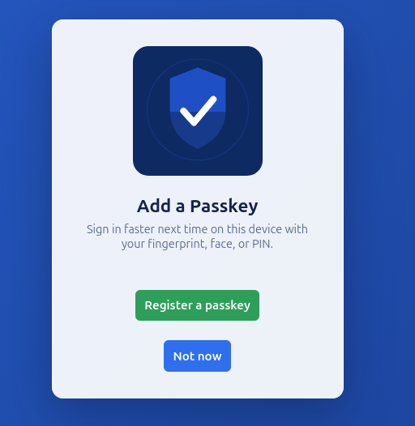

# CheckPointOne OAuth2.0 Server

A minimal, multi-tenant OAuth 2.0 authorization server that also supports third party applications
## Features

- Grant Types include authorization_code, client_credentials, and refresh_token.
- Authorization Code Flows require PKCE for enhanced security
- OIDC support for Google and Github through upstream federated login. Native Idp Support through CheckPointOne(cp1)

<h3 align="center">Login screen</h3>

<p align="center">
  
</p>

<h3 align="center">Signup screen</h3>

<p align="center">
  
</p>

<h3 align="center">Passkey Support</h3>

<p align="center">
  
</p>

## Getting started

```bash
docker compose up -d
```

This builds and starts three services:

- `web` — Authorization Server spins up on localhost. Applies the current model schema and seeds a demo tenant/application/user on startup.
- `db` — Postgres database
- `redis` — Cache used to store short-lived OAuth state

You can find the client demo app here to test different Grant Types locally:

https://github.com/cjurgens17/checkpointone-demo-app

