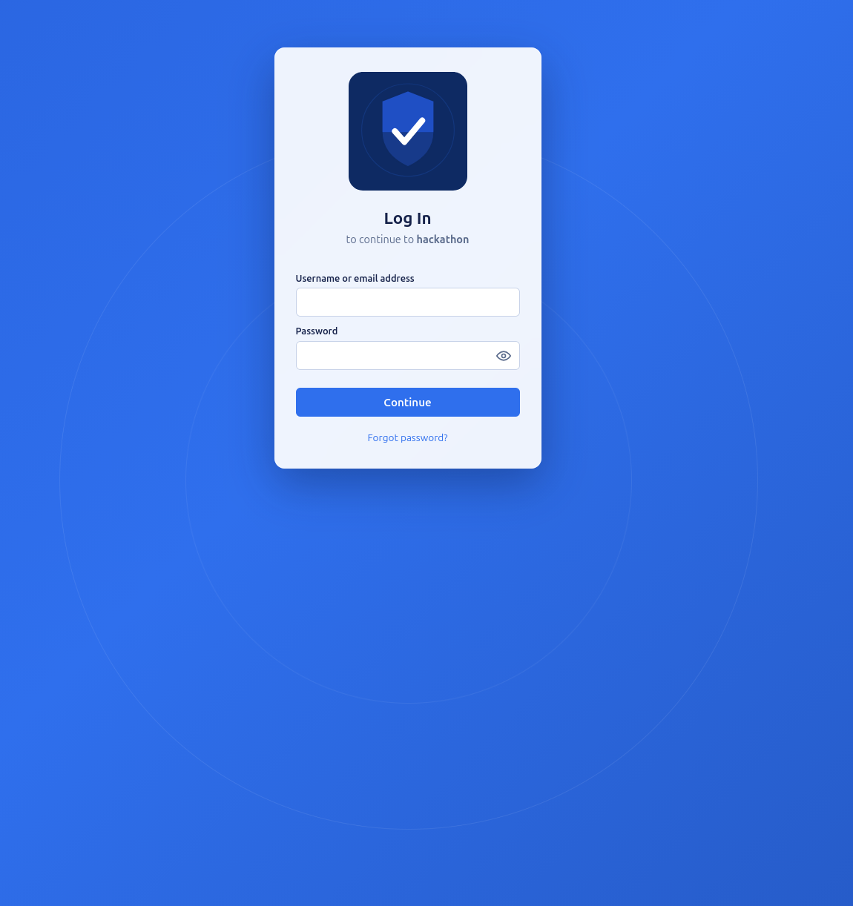

# CheckPointOne OAuth Server

A minimal, multi-tenant OAuth 2.0 authorization server
## Features

- Grant Types including Authorization Code Flow, Authorization Code Flow w/PKCE, Client Credential, and more.
- Branded, multi connection login screen through OpenID utilization

### Login screen



## Getting started

```bash
docker compose up -d
```

This builds and starts three services:

- `web` — Authorization Server spins up on localhost. Applies the current model schema and seeds a demo tenant/application on startup.
- `db` — Postgres database
- `redis` — Cache used to store short-lived OAuth state (e.g. state/nonce pairs during the OpenID login flow)

Try the seeded demo application's authorization request:

```
http://localhost:5000/authorize?response_type=code&client_id=client_sdlkfj234kdjf2l34&redirect_uri=http%3A%2F%2Flocalhost%3A4200%2Fcallback&scope=openid%20profile%20email&state=xyz123&connection=Username-Password-Authentication&code_challenge=abc&code_challenge_method=S256
```

### Local (non-Docker) development

```bash
python -m venv venv
source venv/bin/activate
pip install -r requirements.txt
cp .env.example .env   # points DATABASE_URL/REDIS_URL at the Dockerized Postgres/Redis on :5433/:6379
python app.py
```

Postgres and Redis still need to be running for local (non-Docker) development, so start just those two services with:

```bash
docker compose up -d db redis
```
