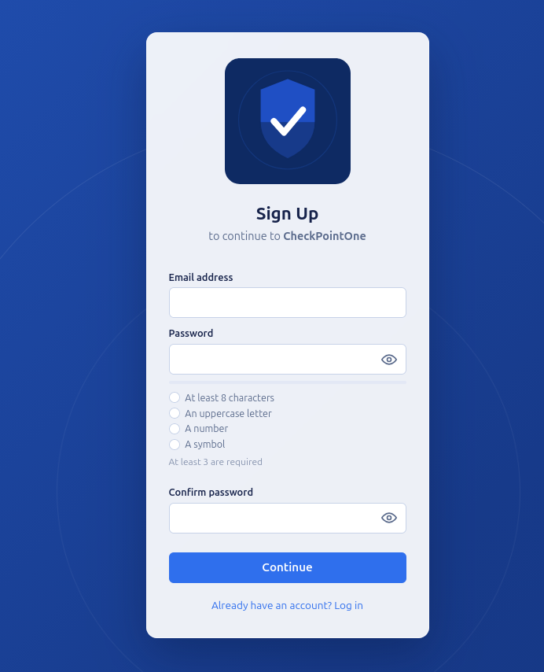

# CheckPointOne OAuth Server

A minimal, multi-tenant OAuth 2.0 authorization server
## Features

- Grant Types include Authorization Code Flow w/PKCE, Client Credentials, and more.
- Branded, variable provider support with enterprise level names such as google and github.

### Login screen


### Signup screen



## Getting started

```bash
docker compose up -d
```

This builds and starts three services:

- `web` — Authorization Server spins up on localhost. Applies the current model schema and seeds a demo tenant/application/user on startup.
- `db` — Postgres database
- `redis` — Cache used to store short-lived OAuth state

You can find the client demo app here to play around with an end to end authorization flow:

https://github.com/cjurgens17/checkpointone-demo-app

